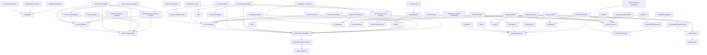

# Feature Graph

```mermaid
graph TD;
  kubedb-provider-aws-->crossplane;
  kubedb-provider-azure-->crossplane;
  kubedb-provider-gcp-->crossplane;
  ace-ocm-addons-->cluster-manager-hub;
  cluster-auth-manager-->cluster-manager-hub;
  cluster-auth-manager-->ace-ocm-addons;
  cluster-auth-manager-->managed-serviceaccount-manager;
  cluster-gateway-manager-->cluster-manager-hub;
  cluster-gateway-manager-->ace-ocm-addons;
  cluster-gateway-manager-->managed-serviceaccount-manager;
  cluster-gateway-manager-->cluster-proxy-manager;
  cluster-proxy-manager-->cluster-manager-hub;
  cluster-proxy-manager-->ace-ocm-addons;
  fluxcd-manager-->cluster-manager-hub;
  fluxcd-manager-->ace-ocm-addons;
  license-proxyserver-manager-->cluster-manager-hub;
  license-proxyserver-manager-->ace-ocm-addons;
  managed-serviceaccount-manager-->cluster-manager-hub;
  managed-serviceaccount-manager-->ace-ocm-addons;
  ace-mc-addons-->multicluster-controlplane;
  mc-auth-manager-->multicluster-controlplane;
  mc-auth-manager-->ace-mc-addons;
  mc-auth-manager-->mc-serviceaccount-manager;
  mc-gateway-manager-->multicluster-controlplane;
  mc-gateway-manager-->ace-mc-addons;
  mc-gateway-manager-->mc-serviceaccount-manager;
  mc-gateway-manager-->mc-proxy-manager;
  mc-proxy-manager-->multicluster-controlplane;
  mc-proxy-manager-->ace-mc-addons;
  mc-fluxcd-manager-->multicluster-controlplane;
  mc-fluxcd-manager-->ace-mc-addons;
  kube-ui-server-mc-->multicluster-controlplane;
  kube-ui-server-mc-->ace-mc-addons;
  mc-license-manager-->multicluster-controlplane;
  mc-license-manager-->ace-mc-addons;
  mc-serviceaccount-manager-->multicluster-controlplane;
  mc-serviceaccount-manager-->ace-mc-addons;
  multicluster-controlplane-->multicluster-ingress-reader;
  multicluster-ingress-reader-->ingress-nginx-mc;
  spoke-cluster-proxy-->cluster-manager-spoke;
  kubestash-->license-proxyserver;
  stash-opscenter-->stash;
  stash-opscenter-->panopticon;
  stash-opscenter-->grafana-operator;
  stash-->license-proxyserver;
  keda-add-ons-http-->keda;
  opencost-grafana-dashboards-->opencost;
  opencost-grafana-dashboards-->grafana-operator;
  opencost-->kube-prometheus-stack;
  opencost-->monitoring-operator;
  kubedb-opscenter-->kubedb;
  kubedb-opscenter-->panopticon;
  kubedb-opscenter-->grafana-operator;
  kubedb-->license-proxyserver;
  grafana-operator-->monitoring-operator;
  kube-grafana-dashboards-->grafana-operator;
  kube-prometheus-stack-->monitoring-operator;
  panopticon-->license-proxyserver;
  prometheus-adapter-->kube-prometheus-stack;
  config-syncer-->license-proxyserver;
  kubevault-opscenter-->kubevault;
  kubevault-opscenter-->grafana-operator;
  kubevault-->license-proxyserver;
  cert-manager-webhook-ace-->cert-manager;
  cert-manager-->gateway-api;
  falco-ui-server-->falco;
  falco-ui-server-->grafana-operator;
  gatekeeper-constraints-->gatekeeper;
  gatekeeper-constraints-->gatekeeper-templates;
  gatekeeper-grafana-dashboards-->gatekeeper;
  gatekeeper-grafana-dashboards-->grafana-operator;
  gatekeeper-templates-->gatekeeper;
  scanner-->license-proxyserver;
  scanner-->grafana-operator;
  catalog-manager-->cert-manager;
  catalog-manager-->kubedb;
  catalog-manager-->kubevault;
  catalog-manager-->service-gateway;
  service-presets-->cert-manager;
  service-presets-->cert-manager-webhook-ace;
  service-presets-->external-dns-operator;
  service-presets-->kubevault;
  service-presets-->service-gateway;
  vcluster-spoke-->vcluster;
  vcluster-proxy-->vcluster-spoke;
```
