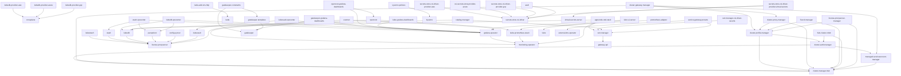

# Feature Graph

```mermaid
graph TD;
  kubedb-provider-aws-->crossplane;
  kubedb-provider-azure-->crossplane;
  kubedb-provider-gcp-->crossplane;
  cluster-auth-manager-->cluster-manager-hub;
  cluster-auth-manager-->managed-serviceaccount-manager;
  cluster-gateway-manager-->cluster-manager-hub;
  cluster-gateway-manager-->cluster-profile-manager;
  cluster-gateway-manager-->managed-serviceaccount-manager;
  cluster-gateway-manager-->cluster-proxy-manager;
  cluster-profile-manager-->cluster-manager-hub;
  cluster-profile-manager-->cluster-auth-manager;
  cluster-proxy-manager-->cluster-manager-hub;
  cluster-proxy-manager-->cluster-profile-manager;
  fluxcd-manager-->cluster-manager-hub;
  fluxcd-manager-->cluster-profile-manager;
  hub-cluster-robot-->cluster-manager-hub;
  hub-cluster-robot-->cluster-auth-manager;
  license-proxyserver-manager-->cluster-manager-hub;
  license-proxyserver-manager-->cluster-profile-manager;
  managed-serviceaccount-manager-->cluster-manager-hub;
  kubestash-->license-proxyserver;
  stash-opscenter-->stash;
  stash-opscenter-->panopticon;
  stash-opscenter-->grafana-operator;
  stash-->license-proxyserver;
  keda-add-ons-http-->keda;
  opencost-grafana-dashboards-->opencost;
  opencost-grafana-dashboards-->grafana-operator;
  opencost-->kube-prometheus-stack;
  opencost-->monitoring-operator;
  kubedb-opscenter-->kubedb;
  kubedb-opscenter-->panopticon;
  kubedb-opscenter-->grafana-operator;
  kubedb-->license-proxyserver;
  grafana-operator-->monitoring-operator;
  kube-grafana-dashboards-->grafana-operator;
  kube-prometheus-stack-->monitoring-operator;
  panopticon-->license-proxyserver;
  prometheus-adapter-->kube-prometheus-stack;
  appscode-otel-stack-->kubedb;
  appscode-otel-stack-->monitoring-operator;
  appscode-otel-stack-->cert-manager;
  gatekeeper-constraints-->gatekeeper;
  gatekeeper-constraints-->gatekeeper-templates;
  gatekeeper-grafana-dashboards-->gatekeeper;
  gatekeeper-grafana-dashboards-->grafana-operator;
  gatekeeper-templates-->gatekeeper;
  kyverno-policies-->kyverno;
  config-syncer-->license-proxyserver;
  kubevault-opscenter-->kubevault;
  kubevault-opscenter-->grafana-operator;
  kubevault-->license-proxyserver;
  secrets-store-csi-driver-provider-aws-->secrets-store-csi-driver;
  csi-secrets-store-provider-azure-->secrets-store-csi-driver;
  secrets-store-csi-driver-provider-gcp-->secrets-store-csi-driver;
  vault-->secrets-store-csi-driver;
  secrets-store-csi-driver-provider-virtual-secrets-->virtual-secrets-server;
  secrets-store-csi-driver-provider-virtual-secrets-->secrets-store-csi-driver;
  cert-manager-csi-driver-cacerts-->cert-manager;
  cert-manager-->gateway-api;
  falco-ui-server-->falco;
  falco-ui-server-->grafana-operator;
  scanner-->license-proxyserver;
  scanner-->grafana-operator;
  catalog-manager-->cert-manager;
  catalog-manager-->kubedb;
  service-gateway-presets-->cert-manager;
  service-gateway-presets-->external-dns-operator;
```
